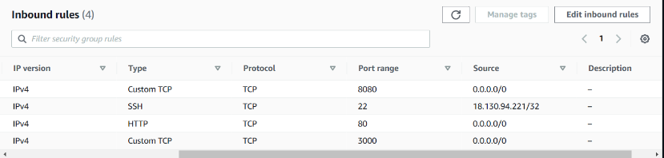

# What is CI - CD CDE

## CI/CD
A CI/CD pipeline is an automated sequence of steps that development teams use to build, test, and deploy their applications. The pipeline allows developers to rapidly and reliably release new features and updates to their applications.

The pipeline consists of multiple stages, each of which performs a specific task. These stages may include:

1. Code repository: The first stage of the pipeline involves checking out the code from the version control system, where the code is stored such as GitHub.

2. Build: The code is compiled and built into an executable format.

3. Test: The code is tested using automated testing tools to identify any errors or bugs.

4. Integration: The code is integrated with other code in the application and tested again to ensure compatibility.

5. Deployment: Once the code has passed all tests, it is deployed to a staging environment for final testing and review by stakeholders.

6. Release: The code is released to production after being approved by stakeholders.

7. Monitoring: The pipeline is monitored to ensure that the application is running smoothly and any issues are quickly identified and addressed.

By using a CI/CD pipeline, developers can reduce the time and effort required for manual testing and deployment, increase the speed of delivering new features and bug fixes to users, and improve the overall quality of their software.


## Difference between CD (Code Delivery) and CDE (Code Deployment)


Continuous Delivery (CD) and Continuous Deployment (CDE) are related concepts that involve automating the software delivery process. However, they differ in terms of the level of automation involved in the deployment process.

Continuous Delivery (CD) is a practice in which code changes are automatically built, tested, and prepared for release to a production environment. Once the code has been prepared, it is then up to the development team to decide when to deploy the changes to production. The deployment process may involve manual steps, such as reviewing the changes and approving them for release.

Continuous Deployment (CDE), on the other hand, involves automatically deploying code changes to production as soon as they pass the necessary tests and checks. This means that changes are continuously delivered to end-users in a fast and reliable manner without requiring any manual intervention. The deployment process is fully automated, and once the code is ready, it is automatically released to production.

In summary, the main difference between CD and CDE is the level of automation in the deployment process. CD automates the process up until the point of release, while CDE automates the entire process of deployment.


## Jenkins


Jenkins is an open-source automation server that is used to build, test, and deploy software applications. It is one of the most popular automation servers used by software development teams around the world.

Jenkins works by allowing developers to create pipelines, which are automated sequences of steps that are executed whenever a code change is made. These pipelines are typically divided into stages that are executed sequentially, with each stage performing a specific task such as compiling the code, running tests, and deploying the application.

Jenkins integrates with a wide range of tools and technologies, including version control systems, testing frameworks, and deployment platforms. This makes it highly flexible and customizable to the needs of different development teams.

One of the key features of Jenkins is its plugin architecture, which allows developers to extend its functionality by adding new plugins. This enables teams to integrate Jenkins with other tools and technologies that are critical to their development process.

In summary, Jenkins is an automation server that allows software development teams to create pipelines that automate the process of building, testing, and deploying software applications. It is highly flexible and customizable, and integrates with a wide range of tools and technologies through its plugin architecture.

Jenkins offers a range of benefits to software development teams, including:

1. Automation: Jenkins allows teams to automate repetitive tasks such as building, testing, and deploying software applications. This reduces the time and effort required for manual tasks, and helps to ensure consistency and reliability in the development process.

2. Customization: Jenkins is highly customizable, allowing teams to create pipelines that meet their specific needs. This flexibility enables teams to integrate Jenkins with other tools and technologies that are critical to their development process.

3. Scalability: Jenkins is designed to scale up or down depending on the needs of the development team. This means that it can be used by teams of all sizes, from small startups to large enterprise organizations.

4. Integration: Jenkins integrates with a wide range of tools and technologies, including version control systems, testing frameworks, and deployment platforms. This makes it easy to integrate Jenkins into existing development processes.

5. Open-source: Jenkins is open-source software, which means that it is free to use and can be customized to meet the specific needs of the development team. This makes it accessible to a wide range of organizations and development teams.

6. Community support: Jenkins has a large and active community of developers and users who contribute to its development and provide support to users. This community support ensures that Jenkins is constantly improving and evolving to meet the needs of the development community.

## Other automation services

Some popular alternatives to Jenkins include:

1. Travis CI: This is a cloud-based continuous integration service that is widely used for building, testing, and deploying software applications.

2. CircleCI: This is a cloud-based continuous integration and delivery platform that offers a range of features such as automatic parallelism (Parallelism is the ability to perform multiple tasks or processes simultaneously.) and intelligent caching.

3. GitLab CI/CD: This is an open-source continuous integration and delivery platform that is tightly integrated with GitLab, a popular source code management platform.

4. Bamboo: This is an on-premise continuous integration and deployment tool developed by Atlassian. It offers a range of features such as automated builds, test reporting, and deployment automation.

5. TeamCity: This is an on-premise continuous integration and deployment tool developed by JetBrains. It offers features such as build automation, code quality analysis, and test reporting.

These tools offer similar functionalities to Jenkins and can be used to automate the process of building, testing, and deploying software applications. The choice of tool will depend on the specific needs and requirements of the development team.


# Building our app through Jenkins


Job1:

- The aim of job 1 is to create a text job in order to make sure all our tests are running correctly.
- After we know that the tests are working we need to create a dev brange and insure that the tests will be ran on this branch
- Create a dev branch `git checkout -b "dev"`

Job 2:

- Automate it, so that if the test is successful, the dev branch is merged with your main branch (it needs to be triggered as soon as job 1 is successful)
- If this is successful it needs to now trigger job 3

Job 3:
- Automate it so that if the branches are merged successfully, the main branch is sent to an EC2 instance

- Before doing job 3, you will need to create an EC2 instance
Jenkins will need to ssh into EC2 in your place (make sure you allow the Jenkins IP in your EC2 security group)
- For job 3, you will also need to make sure that Jenkins has the appropriate permissions to access the EC2 instance -> namely the correct key. Make sure you use the .pem file during job 3


# Job 1

## Step 1 : Generate SSH keypair in .ssh folder

https://github.com/bakarhs/SSH-keys

## Step 2 : Copy the .pub version of your key into GitHub repo


- You want to use the setting tab within your repo and not on your actual GitHub account 


- You can now use `Deploys Keys` to set up your SSH key as you usually would

## Step 3 : Set up your job on Jenkins
 
- We want to start by signing in to Jenkins and starting a new project (we are going to make this a freestyle project)


- You want to make sure to give a good description of all things done in this project
- Make sure to create a log rotation of only 3 (we don't want to save all versions of the project as this will take up too much space)
- You can also check on GitHub projects and in this section you want to put the HHTP of your GitHub Repo.


- The next stage is to apply node plugin add in our GitHub key, and change to the main branch (You want to make sure you add the SSH URL for our Repo when registering our key ) 


- When inputting the KEY you need to speccify it name and type before copying in the contents of our private key 


- Before saving we want to provision it with node and let the shell know where to install and test this

- Now we are ready to test our app

## Adding in a webhook


- Within our projects' configuration we want to add this setting on build triggers


- Now if we go to git hub we can take the IP from our Jenkins project and `http://<ip>//github-webhook/` to our Repo's webhook section so that whenever we change something locally in our repo it will be sent to GitHub then after that to Jenkins

## Plan to go from CI to CI/CD

# Job 2

- We want to now create a dev branch by using `git checkout -b "dev"` - make sure to check on git hub that all the items in the main branch are also in the dev branch
- we now need to change some configurations in our Job such as the branch to build section:


- The next step is to create a new project for our merger of branches and configure it correctly:
- Firstly in the second job we `DO NOT` need to Restrict where this project can be run ( Office 265 Connector)
- We want to add a build trigger and specifier the first job 


- We want to add some `Post -build Actions`:


- Apart from these changes everything else should stay identical

# Job 3

- Before doing job 3, you will need to create an EC2 instance
Jenkins will need to ssh into EC2 in your place (make sure you allow the Jenkins IP in your EC2 security group)




- For job 3, you will also need to make sure that Jenkins has the appropriate permissions to access the EC2 instance -> namely the correct key. Make sure you use the .pem file during job 3

- Similar to job 2 we don't want to do anything in the `Office 365 Conector`
- In job 3 we want our `Source Code Managment` to specify the main branch again 


- Make sure that the build trigger for this job is now the second job


```
rsync -avz -e "ssh -o StrictHostKeyChecking=no" tech201_virtualisation/app ubuntu@3.252.80.112:/home/ubuntu
ssh -o "StrictHostKeyChecking=no" ubuntu@3.252.80.112 <<EOF
    sudo bash ./app/provision.sh
    cd tech201_virtualisation
    cd app
    npm install
    nohup npm start 2>/dev/null 1>/dev/null&

EOF
```

- We now want to add in an SSH agent that will link our Jenkins account to our AWS account 
- We also need to now change our Execute shell to allow us to make changes in our AWS EC2 instance 
- Now that all jobs are created we can test this by pushing a change from our local host all the way to was

# NOTE

- Make sure your SSH key has the correct permissions to allow job 2 to work
- If you are not using an AMI we need to ssh and provision them manually 


